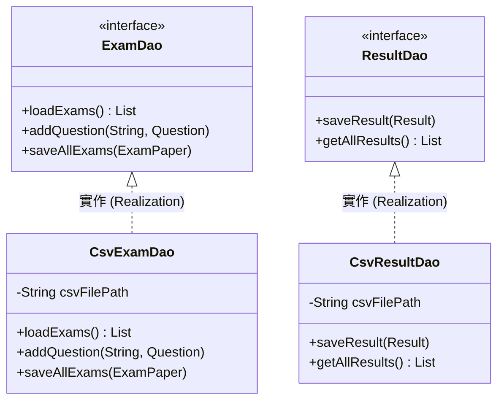

# 資料存取物件 (DAO Layer) UML 類別圖

本圖表專門展示 DAO (Data Access Object) 模式在專案中的實踐，包含介面定義與 CSV 檔案實作。

```mermaid
classDiagram
    class ExamDao {
        <<interface>>
        +loadExams() List
        +addQuestion(String, Question)
        +saveAllExams(ExamPaper)
    }
    class CsvExamDao {
        -String csvFilePath
        +loadExams() List
        +addQuestion(String, Question)
        +saveAllExams(ExamPaper)
    }
    ExamDao <|.. CsvExamDao : 實作 (Realization)

    class ResultDao {
        <<interface>>
        +saveResult(Result)
        +getAllResults() List
    }
    class CsvResultDao {
        -String csvFilePath
        +saveResult(Result)
        +getAllResults() List
    }
    ResultDao <|.. CsvResultDao : 實作 (Realization)
```
