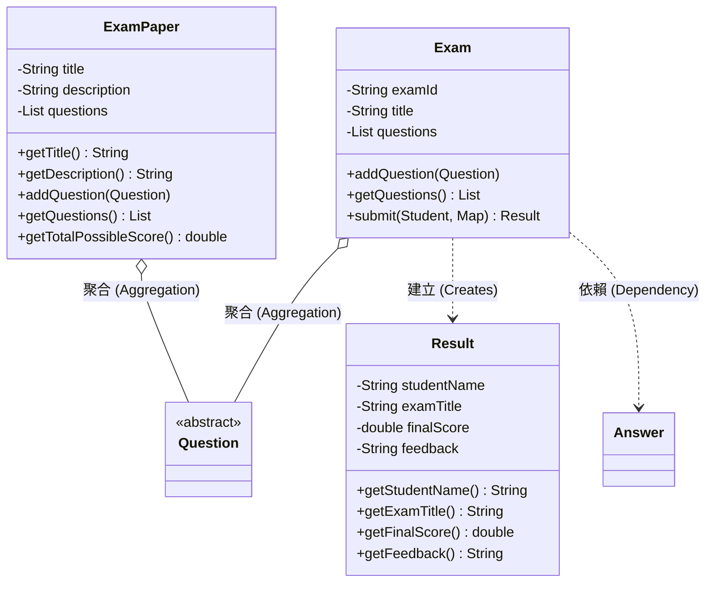

# Exam 體系 UML 類別圖

本圖表專門展示試卷範本 (`ExamPaper`)、進行中測驗 (`Exam`) 與題目 (`Question`) 和成績結果 (`Result`) 的聚合與依賴關係。

```mermaid
classDiagram
    class ExamPaper {
        -String title
        -String description
        -List questions
        +getTitle() String
        +getDescription() String
        +addQuestion(Question)
        +getQuestions() List
        +getTotalPossibleScore() double
    }
    class Exam {
        -String examId
        -String title
        -List questions
        +addQuestion(Question)
        +getQuestions() List
        +submit(Student, Map) Result
    }
    class Question {
        <<abstract>>
    }
    class Answer {
    }
    class Result {
        -String studentName
        -String examTitle
        -double finalScore
        -String feedback
        +getStudentName() String
        +getExamTitle() String
        +getFinalScore() double
        +getFeedback() String
    }
    
    ExamPaper o-- Question : 聚合 (Aggregation)
    Exam o-- Question : 聚合 (Aggregation)
    Exam ..> Result : 建立 (Creates)
    Exam ..> Answer : 依賴 (Dependency)
```
