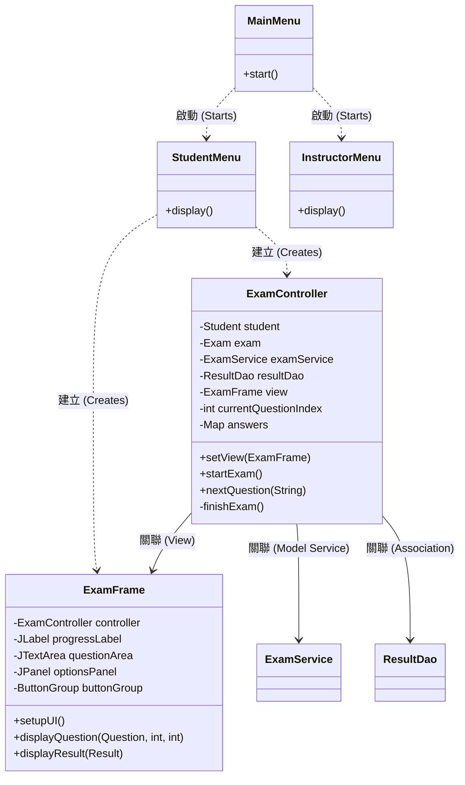

# 使用者介面層 (View & Controller) UML 類別圖

本圖表專門展示 MVC 架構中 Controller 與 View 的互動，以及選單類別 (Menu) 的職責。

```mermaid
classDiagram
    class MainMenu {
        +start()
    }
    class StudentMenu {
        +display()
    }
    class InstructorMenu {
        +display()
    }
    class ExamController {
        -Student student
        -Exam exam
        -ExamService examService
        -ResultDao resultDao
        -ExamFrame view
        -int currentQuestionIndex
        -Map answers
        +setView(ExamFrame)
        +startExam()
        +nextQuestion(String)
        -finishExam()
    }
    class ExamFrame {
        -ExamController controller
        -JLabel progressLabel
        -JTextArea questionArea
        -JPanel optionsPanel
        -ButtonGroup buttonGroup
        +setupUI()
        +displayQuestion(Question, int, int)
        +displayResult(Result)
    }

    MainMenu ..> StudentMenu : 啟動 (Starts)
    MainMenu ..> InstructorMenu : 啟動 (Starts)
    
    StudentMenu ..> ExamController : 建立 (Creates)
    StudentMenu ..> ExamFrame : 建立 (Creates)
    
    ExamController --> ExamFrame : 關聯 (View)
    ExamController --> ExamService : 關聯 (Model Service)
    ExamController --> ResultDao : 關聯 (Association)
```
