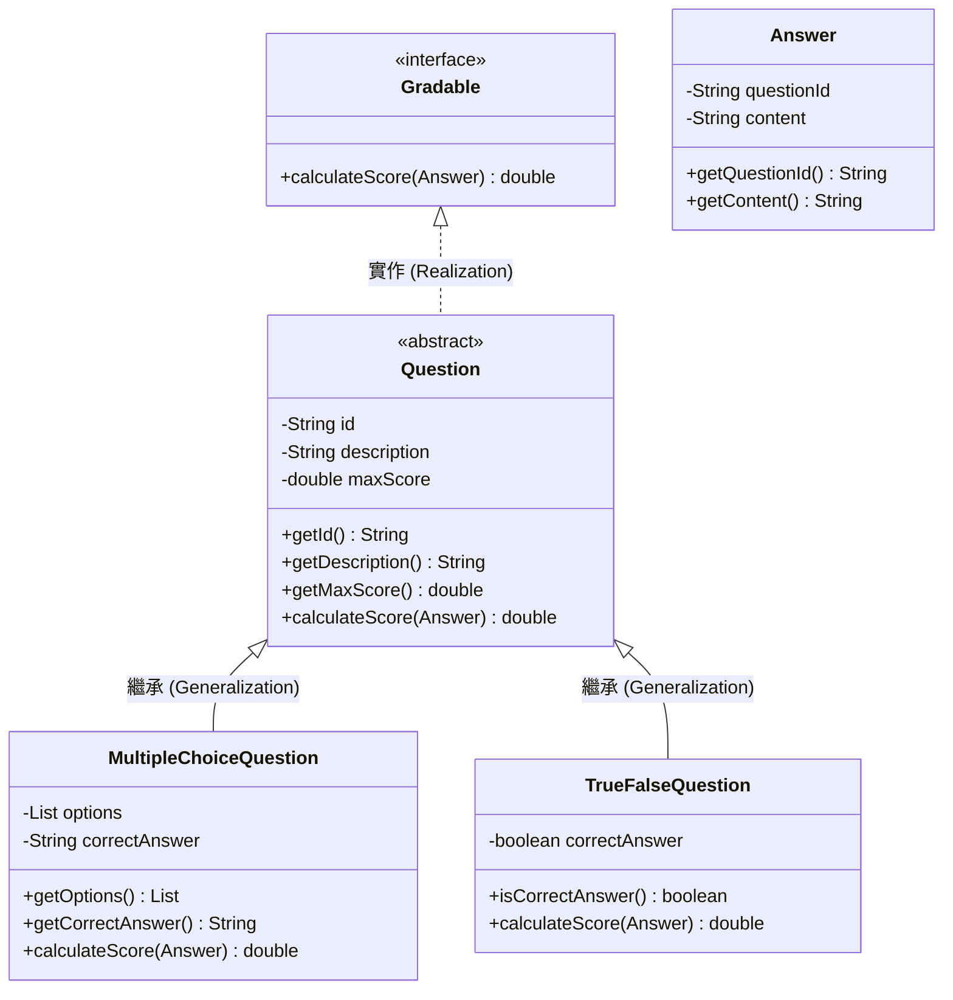

# Question 體系 UML 類別圖

本圖表專門展示考題 (`Question`) 的繼承體系、計分介面 (`Gradable`)，以及作答 (`Answer`) 的結構。

```mermaid
classDiagram
    class Gradable {
        <<interface>>
        +calculateScore(Answer) double
    }
    class Question {
        <<abstract>>
        -String id
        -String description
        -double maxScore
        +getId() String
        +getDescription() String
        +getMaxScore() double
        +calculateScore(Answer) double
    }
    class MultipleChoiceQuestion {
        -List options
        -String correctAnswer
        +getOptions() List
        +getCorrectAnswer() String
        +calculateScore(Answer) double
    }
    class TrueFalseQuestion {
        -boolean correctAnswer
        +isCorrectAnswer() boolean
        +calculateScore(Answer) double
    }
    Gradable <|.. Question : 實作 (Realization)
    Question <|-- MultipleChoiceQuestion : 繼承 (Generalization)
    Question <|-- TrueFalseQuestion : 繼承 (Generalization)

    class Answer {
        -String questionId
        -String content
        +getQuestionId() String
        +getContent() String
    }
```
