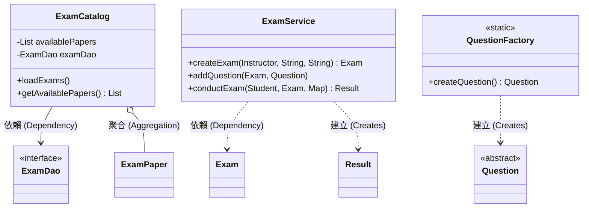

# 業務邏輯與儲存庫 (Service & Repository) UML 類別圖

本圖表專門展示負責核心業務邏輯的 `ExamService`、快取資料的 `ExamCatalog`，以及負責產生物件的 `QuestionFactory`。

```mermaid
classDiagram
    class ExamCatalog {
        -List availablePapers
        -ExamDao examDao
        +loadExams()
        +getAvailablePapers() List
    }
    class ExamDao {
        <<interface>>
    }
    ExamCatalog --> ExamDao : 依賴 (Dependency)
    ExamCatalog o-- ExamPaper : 聚合 (Aggregation)
    
    class ExamService {
        +createExam(Instructor, String, String) Exam
        +addQuestion(Exam, Question)
        +conductExam(Student, Exam, Map) Result
    }
    class Exam {
    }
    class Result {
    }
    ExamService ..> Exam : 依賴 (Dependency)
    ExamService ..> Result : 建立 (Creates)

    class QuestionFactory {
        <<static>>
        +createQuestion() Question
    }
    class Question {
        <<abstract>>
    }
    QuestionFactory ..> Question : 建立 (Creates)
```
