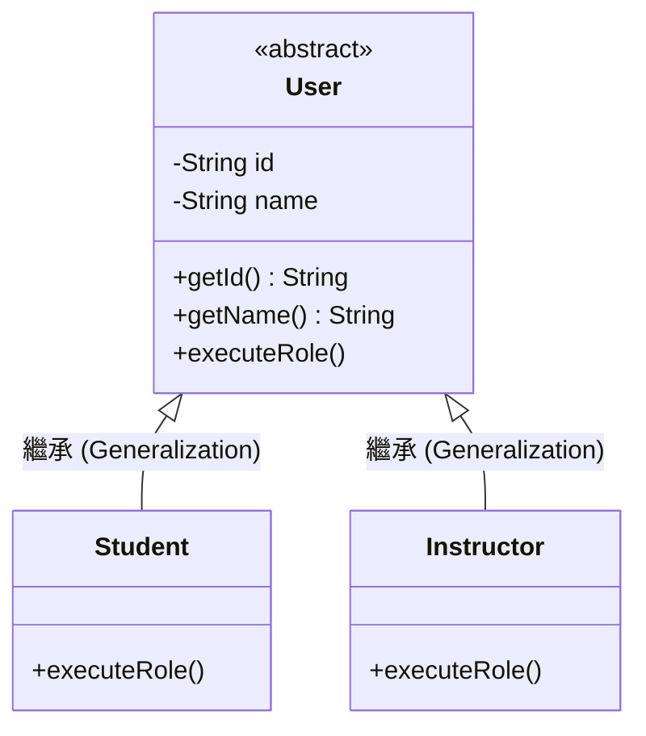

# User 體系 UML 類別圖

本圖表專門展示系統使用者 (`User`) 的繼承體系，以及多型 (`executeRole`) 的實作。

```mermaid
classDiagram
    class User {
        <<abstract>>
        -String id
        -String name
        +getId() String
        +getName() String
        +executeRole()
    }
    class Student {
        +executeRole()
    }
    class Instructor {
        +executeRole()
    }
    User <|-- Student : 繼承 (Generalization)
    User <|-- Instructor : 繼承 (Generalization)
```
